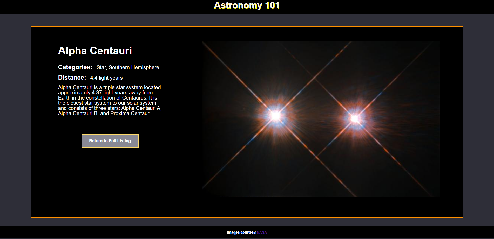
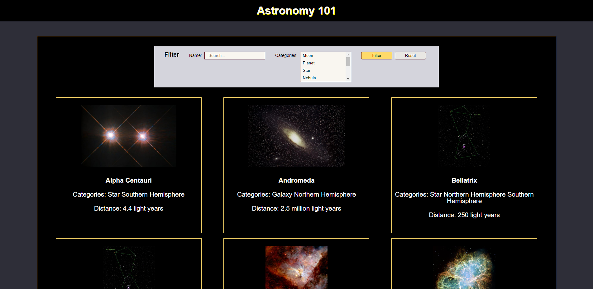

# Module Assessment - Part 2: Vue

## Introduction

This part of the hands-on assessment asks you to modify an existing Vue application. The application requires five modifications, each of which adds a new feature to the application. Your assignment is to add those five new features.

**After completing this part of the coding assessment, you need to `add`, `commit`, and `push` the code to your repository.**

**After completing both parts of the assessment, submit it to BootcampOS.**

## Hints and suggestions

* Each feature is independent of the others. If you become stuck, feel free to move on the next feature. You can revisit this work later, if you have time. 
* To facilitate your return to a challenging problem, leave comments describing the current state of your work. Be sure to comment out any code that prevents the application from running.
* `push` your code often. Whenever you feel like you've made good progress and your code builds, commit and push your changes.
* Your instructors can't evaluate your code if it doesn't build properly. _Please ensure you don't have any build errors before submitting your code._

## Exploring the code

Build and run the Vue application. Then explore the two files in in the `views` folder:

- The **All Celestial Objects** view is the main view for the application. It includes a text-based list of objects you might view in the night sky. You can modify this list using the working filter button, which allows you to search for celestial objects by name or by category. 

- The **Celestial Object Details** view is initially only accessible by entering http://localhost:5173/celestial-objects/details in your browser. This view currently displays details for the star system **Alpha Centauri**.

## Requirements

<hr>

### Task 1: Create an `AppHeader` component

Currently the `App.vue` component includes the definition of the application header. The plan is to add new features to the application header in the next release. To prepare for these changes, you must make the application header a separate component. 

Create a new Vue component called `AppHeader`. Then move the existing `#app-header` element and its related styles into this new file. Import and use the new component in `App.vue`. 

> Note: This task is structural, and doesn't change the application's appearance in any way. 

<hr>

### Task 2: Add navigation that returns the user to `AllCelestialObjects`.

 In `CelestialObjectDetails`, add a router-link that returns the user to the route named `AllCelestialObjects`. Have the router-link display the text "Return to Full Listing", and assign it the class "return-link."

The "return-link" class has some rudimentary styling. Improve the aesthetics by modifying the CSS in the following ways:

- Add 15 pixels of padding within the button. 
- For the background, use the color `#898994`.
- Add a 3 pixel border to the solid background using the color `#feda6a`
- Set the button's text color to `white`.

When you've added the router-link and styled it correctly, the **CelestialObjectDetailsView** resembles the following image: 



> Note: that the image's position may vary depending on the width of the browser display. 

<hr>

### Task 3: Update the list of categories in the `CelestialObjectFilter` component


The `CelestialObjectFilter` component currently uses a hard-coded list of 3 categories. Update it to get the list of categories from the server API. This requires two changes:  

- Create a new method in `CelestialObjectService` to get the category list from the server. Use the API path `/api/celestial-objects/categories`.

- Modify `CelestialObjectFilter` so that when it's loaded it uses the `CelestialObjectService` to populate the `allCategories` array.

When complete the **AllCelestialObjectsView** filter displays a scrollable list of 8 different categories.

<hr>

### Task 4: Make the `CelestialObjectDetailsView` dynamic

Currently you can only access `CelestialObjectDetailsView` by entering the path `/celestial-objects/details` in your browser. This view shows details for the star system **Alpha Centauri**, which has the ID `1005`.

Update the application router so that `CelestialObjectDetailsView` can display the details for any celestial object. Use the path `/celestial-objects/nnnn`, where `nnnn` is a celestial object's id. For example, you would access **Alpha Centauri** using the path `/celestial-objects/1005`.

Here are a few other examples you can use for testing:
- /celestial-objects/1001 - Moon
- /celestial-objects/1008 - Crab Nebula
- /celestial-objects/1012 - Venus

### Task 5: Update display of the `CelestialObjectsList` component 

The `CelestialObjectsList` component currently shows the list of celestial objects as a string of JSON text. 

```JavaScript
<template>
  <div id="card-container">
    {{JSON.stringify(celestialObjectsList)}}
  </div>
</template>
```

The recently added `CelestialObjectsCard` component displays information for a specific celestial object. Update the `CelestialObjectsList` component to iterate over the array of celestial objects, displaying each object's information in a `CelestialObjectsCard` component. The `CelestialObjectsCard` is already configured to navigate to the `CelestialObjectDetailsView` when clicked.

When complete, the **AllCelestialObjectsView** resembles the following image:  



Note that the number of celestial objects displayed per row varies depending on the width of the browser window.

> Note: Even if you weren't able to complete Task 4, you can still finish Task 5. Even if every `CelestialObjectsCard` directs you to the detail page for **Alpha Centari**, you still have fulfilled all of the Task 5 requirements. 


## Submit your work

When you've completed this part of the assessment, be sure to push your code to your repository. If you've finished both parts of the coding assessment, submit the assessment in BootcampOS.